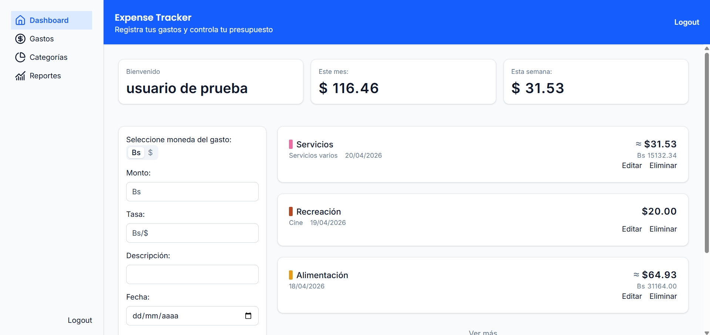
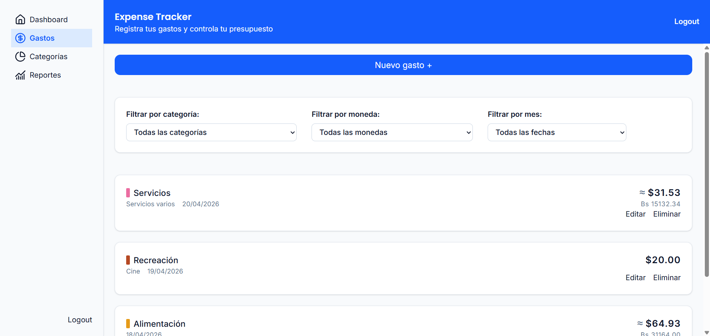
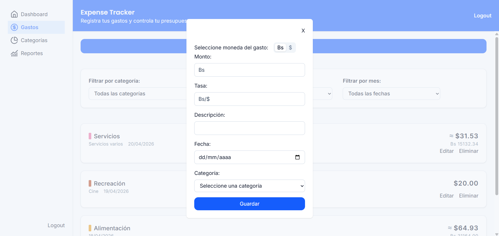
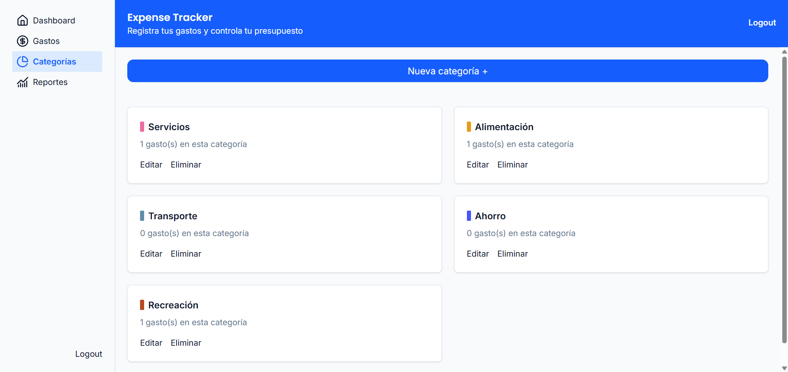
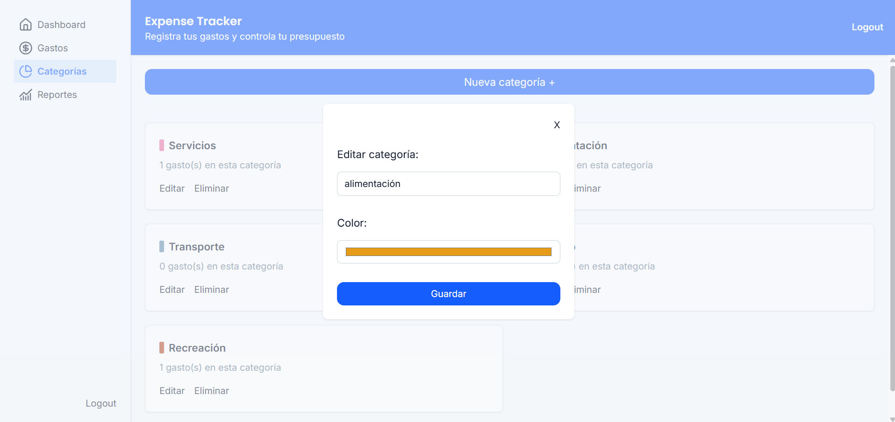
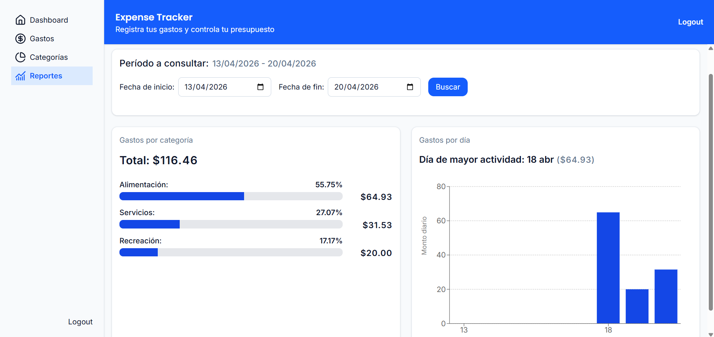

# My finances

Aplicación fullstack para gestionar y analizar gastos personales con métricas financieras e insights mensuales.  

Diseñada considerando el contexto venezolano, permite manejar gastos en bolívares y dólares con conversión automática.

---

## 🚀 Live Demo

👉 https://my-finances-app-seven.vercel.app/login

### 🔑 Demo Access
Email: demo@test.com  
Password: 123456

---

## 📸 Screenshots

### Dashboard


### Lista de gastos


### Crear gasto


### Administrar categorías


### Editar categoría


### Reportes


---

## 🧠 Features

- Registro y gestión de gastos (CRUD)
- Autenticación de usuarios
- Categorías personalizadas por usuario
- Conversión automática entre Bs y USD
- Reportes financieros y métricas para el periodo dado

---

## 🛠️ Stack tecnológico

- Next.js
- TypeScript
- Sequelize
- PostgreSQL
- bcrypt
- JWT - jose
- Recharts

---

## 🏗️ Arquitectura

La aplicación sigue un patrón Backend for Frontend (BFF), donde el servidor de Next.js gestiona tanto el renderizado como la lógica de acceso a datos y autenticación.

El frontend nunca accede directamente a la base de datos; toda interacción pasa por servicios en el backend. 

En lugar de utilizar una API REST tradicional, la comunicación entre cliente y los servicios de backend se realiza a través de Server Functions.

### 🗄️ Modelo de datos

```
User (1) - (N) Expense
User (1) - (N) Category
Category (1) - (N) Expense
verification_tokens
pending_users
```
Esta estructura permite definir categorías únicas para cada usuario, lo que facilita el filtrado de gastos para el mismo.

```
User
----
id: integer (PK)
username: string
email: string
password: string
```

```
Category
--------
id: integer (PK)
name: string
color: string
user_id: integer (FK)
```

```
Expense
-------
id: integer (PK)
description: string
date: date
amount_bs: decimal
amount_usd: decimal
rate: decimal
user_id: integer (FK)
category_id: integer (FK)
```

Adicionalmente, para poder verificar el correo electrónico de un usuario que se registra por primera vez, utilizamos las entidad `pending_users` en la cual se almacenan temporalmente los datos del nuevo usuario mientras este es verificado a través de un token que a su vez estará almacenado en la tabla `verification_tokens`.

```
pending_users
-------------
id: integer (PK)
username: string
email: string
password_hash: string
```

```
verification_tokens
-------------------
id: integer (PK)
email: string
token: string
type: string
expires: Date
```


### ⚙️ Decisiones técnicas 

- Las contraseñas se almacenan hasheadas usando bcrypt
- La autenticación se maneja utilizando un JWT que se almacena en una cookie
- El atributo principal de la entidad Expense será `amount_usd`, sin embargo, para adaptarse al caso Venezuela existe también el atributo `amount_bs` el cual se utilizará para calcular un valor para `amount_usd` a través del atributo `rate`
- Al registrar un usuario nuevo este se almacenará temporalmente en la tabla `pending_users` mientras el usuario recibe el código de verificación y lo proporciona a través del cliente. Luego se borrará el registro en `pending_users` y se creará uno en `users`.

---

## Estado actual del proyecto

- ✅ Primera versión publicada

---

## 👤 Autor

Ricardo Ojeda - Frontend Developer
